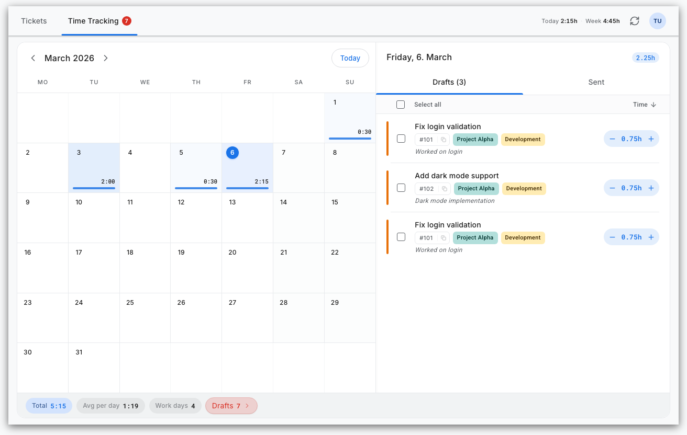
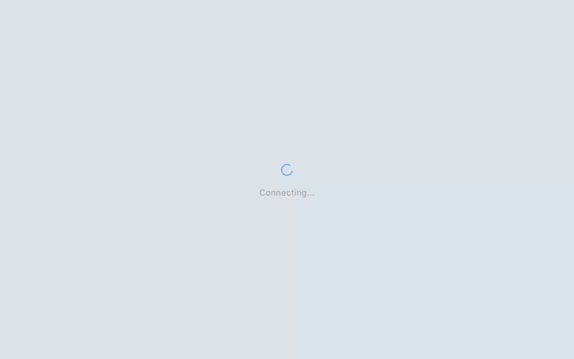
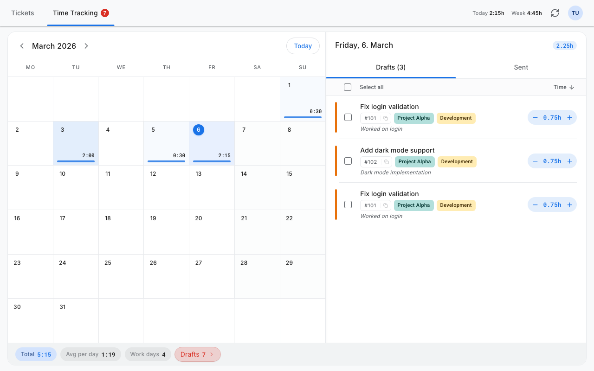
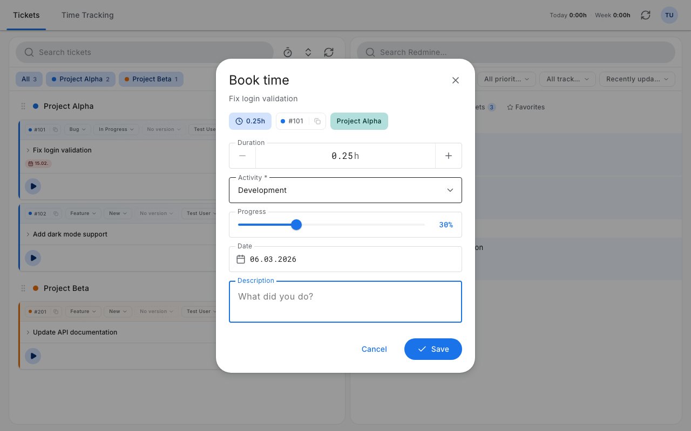
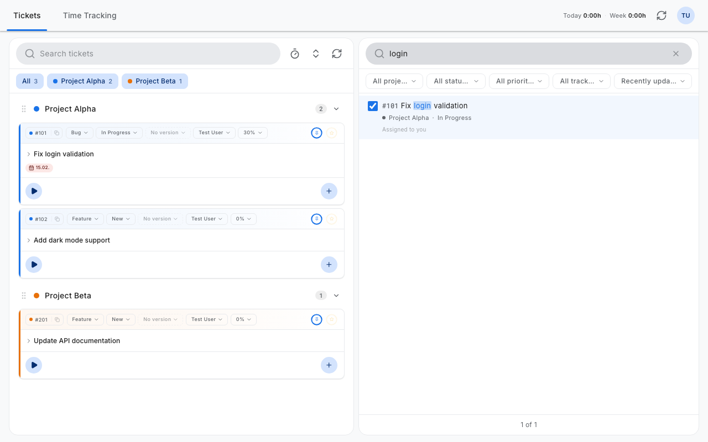
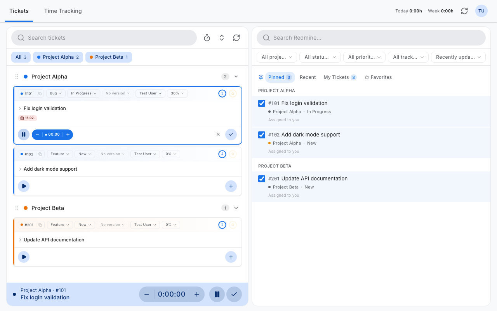
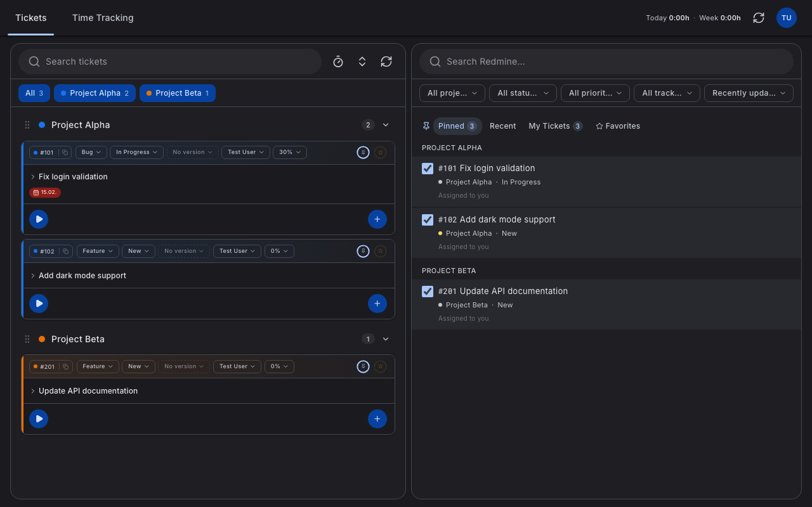
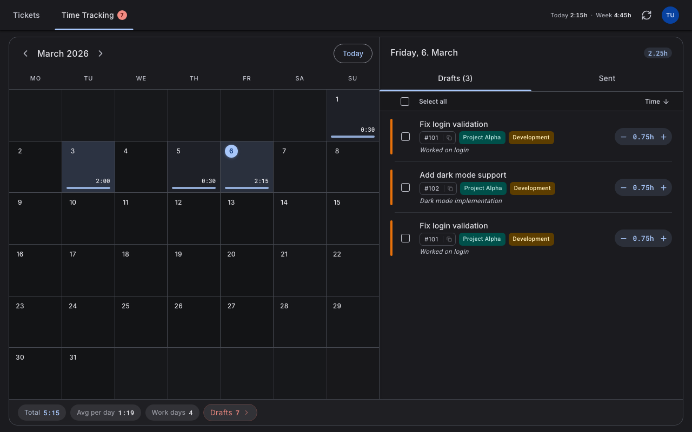

<div align="center">
  <h1>Redmine Tracker</h1>
  <p><strong>Track time beautifully.</strong> A modern Redmine client that feels like a Google app.</p>

  <p>
    <a href="#screenshots">Screenshots</a>&nbsp;&nbsp;&middot;&nbsp;&nbsp;<a href="#quick-start">Quick Start</a>&nbsp;&nbsp;&middot;&nbsp;&nbsp;<a href="CONTRIBUTING.md">Contributing</a>
  </p>

  <br />

  <picture>
    <source media="(prefers-color-scheme: dark)" srcset="docs/screenshots/hero-dark.png">
    <source media="(prefers-color-scheme: light)" srcset="docs/screenshots/hero-light.png">
    
  </picture>

  <br />
  <br />

<a aria-label="CI status" href="https://github.com/Sebastian-Lemling/redmine-time-tracker/actions/workflows/ci.yml"></a>&nbsp;
<a aria-label="MIT license" href="LICENSE"></a>&nbsp;
<a aria-label="TypeScript 5.8" href="https://www.typescriptlang.org/"></a>&nbsp;
<a aria-label="Node.js 18+" href="https://nodejs.org/"></a>

</div>

<br />

## Why Redmine Tracker?

Redmine's built-in time tracking is clunky and slow. This app replaces it with a fast, keyboard-friendly interface that makes logging hours painless — start a timer with one click, book time from a clean dialog, review your month in a calendar with heat map.

## Features

- **Project-grouped tickets** — drag-to-reorder, color-coded by project
- **Inline editing** — status, tracker, assignee, version, progress — right on the card
- **One-click timers** — start from any ticket, live counter, pause & resume
- **Manual booking** — duration stepper, activity picker, date & description
- **Month calendar** — heat map visualization with daily detail panel
- **Batch sync** — review drafts, then push to Redmine in one click
- **Full-text search** — filter by project, status, tracker, priority
- **Pins & favorites** — organize your most-used tickets
- **Dark mode** — full Material Design 3 dark color scheme
- **i18n** — German and English, extensible to more languages

## See it in action

<div align="center">
  <picture>
    <source media="(prefers-color-scheme: dark)" srcset="docs/screenshots/timer-workflow-dark.gif">
    <source media="(prefers-color-scheme: light)" srcset="docs/screenshots/timer-workflow.gif">
    
  </picture>
  <br />
  <sub>Start a timer &rarr; book your time &rarr; review in the calendar</sub>
</div>

## Screenshots

<table>
<tr>
<td width="50%">

</td>
<td width="50%">

</td>
</tr>
<tr>
<td width="50%">

</td>
<td width="50%">

</td>
</tr>
</table>

<details>
<summary>&nbsp;<strong>Dark mode</strong></summary>
<br />





</details>

## Quick Start

```bash
git clone https://github.com/Sebastian-Lemling/redmine-time-tracker.git
cd redmine-time-tracker
npm install
```

Run the interactive setup wizard — it will ask whether you want to run locally or with Docker:

```bash
npm run setup
```

### Local

After setup, start the development server:

```bash
npm run dev
```

The app opens at **http://localhost:5173**. The proxy server starts automatically alongside Vite.

### Docker

The setup wizard builds the image and starts the container automatically. The app will be available at **http://localhost:9500**.

Timelog data is persisted in a Docker volume and survives container restarts.

<details>
<summary>Docker management commands</summary>

| Command                 | Description                               |
| ----------------------- | ----------------------------------------- |
| `npm run docker:up`     | Start the container                       |
| `npm run docker:down`   | Stop and remove the container             |
| `npm run docker:update` | Pull latest changes, rebuild, and restart |
| `npm run docker:logs`   | Follow container logs                     |
| `npm run docker:build`  | Rebuild the image without starting        |

</details>

## Contributing

Contributions are welcome. See [CONTRIBUTING.md](CONTRIBUTING.md) for development setup, code quality checks, and commit conventions.

## License

[MIT](LICENSE) &copy; Sebastian Lemling
